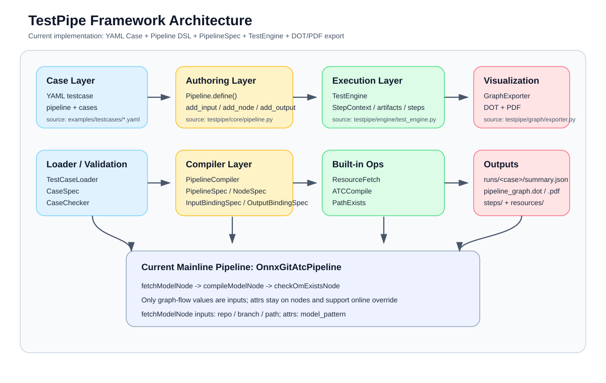

# TestPipe 总体设计

## 1. 框架定位

TestPipe 当前是一个围绕 `PipelineSpec` 运转的测试编排框架，主链路已经收敛为：

`YAML Case -> TestCaseLoader -> Pipeline DSL -> PipelineCompiler -> PipelineSpec -> TestEngine -> runs/`

框架目标不是做通用工作流平台，而是把测试流程拆成可注册的 `TestOp`，再用 Python DSL 显式构图，最后统一执行、导图、校验和沉淀运行产物。

## 2. 当前实现原则

- Pipeline 通过 `define()` 显式构图。
- Node 以真实 `op` 定义和输入输出契约为中心。
- 资源获取、ATC 转换等能力按目录组织，分类通过文件夹体现。
- TestCase 负责填数据，Pipeline 负责连图，执行引擎只消费静态编译结果。
- 图导出默认输出 `.dot`，并在系统存在 `dot` 命令时同步导出 `.pdf`。

## 3. 当前主线示例

仓库现在只保留一个内置 Pipeline：

- `OnnxGitAtcPipeline`

主线流程为：

1. `fetchModelNode` 从 Git 资源中获取 ONNX 模型。
2. `compileModelNode` 调用 `atc` 生成 `.om`。
3. `checkOmExistsNode` 校验输出文件是否生成。

其中当前主线的关键规则是：

- `fetchModelNode` 的输入是 `repo / branch / path`，属性是 `model_pattern`。
- `compileModelNode` 的输入只有 `model_path`，其余参数通过属性控制。
- 属性既可以作为节点构造时的离线默认值，也可以由 testcase 做在线覆盖。

示例 testcase 见 [onnx_git_atc.yaml](/home/wyb/AscendCode/TestPipe/examples/testcases/onnx_git_atc.yaml)。

## 4. 架构视图

框架总览见 [框架架构图](06_框架架构图.md)。



从职责上看，可以分成 5 层：

- 用例层：YAML 文档、case 归一化、case 校验。
- 编排层：`Pipeline` DSL、节点引用、输出绑定。
- 编译层：把 DSL 编译成稳定的 `PipelineSpec`。
- 执行层：`TestEngine`、`StepContext`、artifact/run 目录管理。
- 可视化与文档层：DOT/PDF 导出、API 文档生成、Docsify 文档站。

## 5. 软件调用主链

运行一次主线 testcase 时，软件时序见 [软件时序调用图](09_软件时序调用图.md)。

关键调用顺序是：

1. CLI 加载 testcase YAML。
2. `TestCaseLoader` 产出 `CaseSpec`。
3. `create_pipeline()` 创建 Pipeline 实例。
4. `PipelineCompiler` 生成 `PipelineSpec`。
5. `TestEngine` 逐节点执行 `ResourceFetch / ATCCompile / PathExists`。
6. 执行结束后写出 `summary.json`、图文件和 step 日志。

## 6. 核心对象

- `Pipeline`：作者写图时使用的 DSL 基类。
- `NodeHandle / NodeOutputRef / PipelineInputRef`：构图引用对象。
- `PipelineSpec / NodeSpec / InputBindingSpec / OutputBindingSpec`：统一静态模型。
- `CaseSpec`：YAML 归一化后的单个用例。
- `TestOp`：算子实现基类。
- `TestEngine`：执行器。

更完整的对象说明见：

- [核心对象模型设计](07_核心对象模型设计.md)
- [Pipeline Python 实现](03_Pipeline_Python实现.md)
- [Node API](../api/node_api.md)
- [Pipeline API](../api/pipeline_api.md)

## 7. 当前目录组织

```text
testpipe/
  core/           # DSL、编译器、注册表
  ops/
    resource/     # 资源获取
    atc/          # ATC 编译
  pipelines/
    atc/          # 主线 Pipeline
  graph/          # DOT/PDF 图导出
  engine/         # 执行引擎
  validation/     # case 契约校验
```

## 8. 当前文档阅读顺序

建议按下面顺序阅读：

1. [Pipeline Python 实现](03_Pipeline_Python实现.md)
2. [TestCase YAML 规范](04_TestCase_YAML规范.md)
3. [Pipeline 可视化导出](05_Pipeline可视化导出.md)
4. [框架架构图](06_框架架构图.md)
5. [软件时序调用图](09_软件时序调用图.md)
