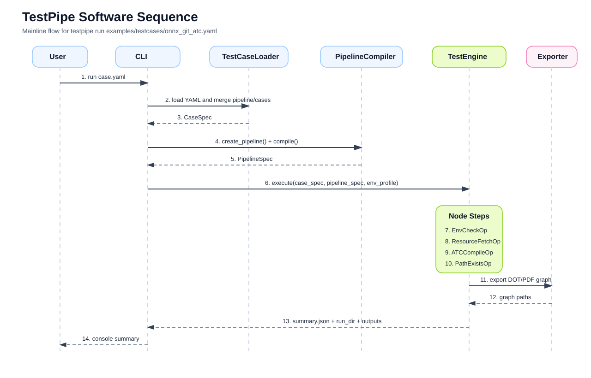

# 软件时序调用图

## 当前主流程

1. `testpipe run case.yaml`
2. `TestCaseLoader` 解析 YAML
3. `PipelineCompiler` 生成 `PipelineSpec`
4. `TestEngine` 执行：
   - `ResourceFetchOp`
   - `ATCCompileOp`
5. 导出图和结果

## 为什么导图放在执行后

因为当前导图不只显示静态结构，还会带上：

- 真实输入
- 真实输出
- 真实命令

这样图既能看流程，也能看这次 case 实际执行了什么。
