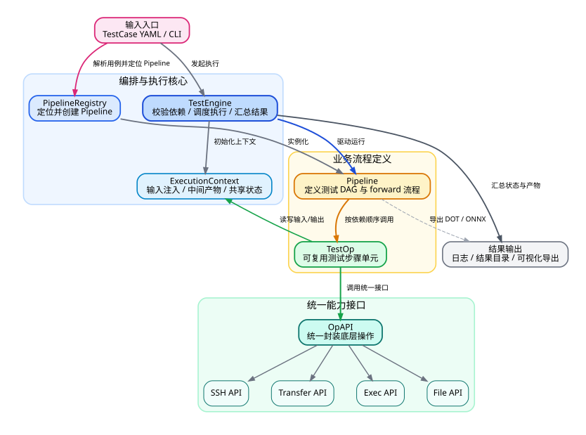
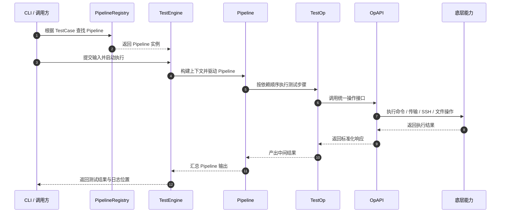

# TestPipe PPT展示版

## 系统架构图

可直接使用矢量图:

### 讲解重点

- 入口统一: `TestCase YAML + CLI`
- 编排核心: `PipelineRegistry + TestEngine`
- 执行主链路: `Pipeline -> TestOp -> OpAPI`
- 结果沉淀: 日志、结果目录、可视化导出

## 接口调用时序图

下面使用 Mermaid 精简版，适合直接贴到支持 Mermaid 的 PPT/Markdown 工具中展示。

### 讲解重点

- 前半段聚焦装配: 查找 Pipeline、创建实例、提交输入
- 中间段聚焦执行: `TestEngine` 驱动 `Pipeline`
- 核心链路聚焦接口调用: `TestOp -> OpAPI -> 底层能力`
- 结果统一回收: 执行结果回到 `TestEngine` 对外输出

### 相关素材

- Mermaid 源文件: `assets/ppt_接口调用时序图.mmd`
- DOT 源文件: `assets/ppt_接口调用时序图.dot`
